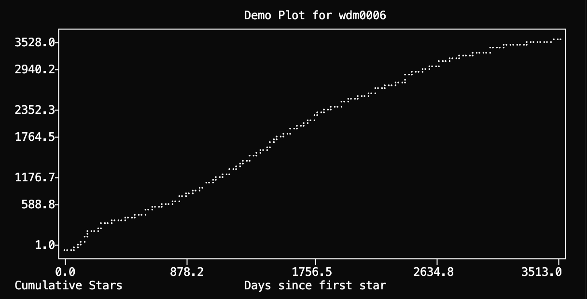

# Stargazers

A modern CLI tool to fetch, analyze, and summarize the stargazers or forkers of any public GitHub repository.



## What is this?

**Stargazers** helps you understand who is starring or forking your GitHub project. It fetches all stargazers or forkers for a given repository (or multiple repositories), retrieves public metadata for each user, and outputs a CSV file with rich summary statistics. This is useful for open source maintainers, community managers, or anyone curious about their project's audience.

## Features
- Fetches all stargazers or forkers for any public GitHub repository
- Retrieves public metadata for each user (name, company, location, email, bio, followers, public repos)
- Outputs results to a CSV file for further analysis
- Prints summary statistics, such as the top locations of your stargazers or forkers
- Handles GitHub API rate limits gracefully (with optional authentication)
- Beautiful CLI output with [rich](https://github.com/Textualize/rich)
- Easy to install and use as a CLI tool

## Installation

You can install this tool locally in editable mode (recommended for development):

```sh
uv pip install -e .
```

Or with pip:

```sh
pip install -e .
```

Or install directly from GitHub (latest main branch):

```sh
pip install git+https://github.com/wdm0006/stargazers.git
```

## Usage

After installation, you can run the CLI from anywhere in your shell using the `stargazers` command followed by a subcommand:

**Subcommands:**

*   `repos`: Fetches and analyzes stargazers for one or more repositories.
*   `forkers`: Fetches and analyzes forkers for one or more repositories.
*   `account-trend`: Analyzes star trends over time for all of a user's owned repositories.

### Analyzing Repository Stargazers

To analyze stargazers for specific repositories:
```sh
stargazers repos <owner/repo> [<owner/repo> ...]
```
Example:
```sh
stargazers repos wdm0006/pygeohash wdm0006/elote
```

### Analyzing Repository Forkers

To analyze forkers for specific repositories:
```sh
stargazers forkers <owner/repo> [<owner/repo> ...]
```
Example:
```sh
stargazers forkers wdm0006/pygeohash wdm0006/elote
```

### Analyzing User Account Star Trends

To analyze the overall star trend for a user's account, optionally including other specific repositories, excluding some, and displaying a terminal chart:
```sh
stargazers account-trend <username> [--include-repo <owner/repo_to_include>] [--exclude-repo <owner/repo_to_exclude>] [--line-chart]
```
You can specify multiple `--include-repo` and `--exclude-repo` options if needed. The `--line-chart` flag will print a plot of cumulative stars to your terminal.

Example:
```sh
stargazers account-trend wdm0006
stargazers account-trend someotheruser --exclude-repo someotheruser/old-project
stargazers account-trend wdm0006 --include-repo scikit-learn-contrib/category_encoders --exclude-repo wdm0006/some-old-repo
stargazers account-trend wdm0006 --line-chart
stargazers account-trend wdm0006 --include-repo scikit-learn-contrib/category_encoders --line-chart
```

### Output files
- For the `repos` subcommand with a single repo: `<owner>_<repo>_stargazers.csv`.
- For the `repos` subcommand with multiple repos: `all_repos_stargazers.csv`.
- For the `forkers` subcommand with a single repo: `<owner>_<repo>_forkers.csv`.
- For the `forkers` subcommand with multiple repos: `all_repos_forkers.csv`.
- For the `account-trend` subcommand: `<username>_account_stars_by_day.csv`.
  This file will contain columns: `star_date`, `new_stars_on_day`, `cumulative_stars_up_to_day`.

For `repos` and `forkers`, the CSVs will have a `repo` column indicating the source repository when multiple repositories are processed.

### Example Output

```
Fetching stargazers for: wdm0006/pygeohash
Requesting: https://api.github.com/repos/wdm0006/pygeohash/stargazers with params {'per_page': 100, 'page': 1}
Response status: 200
Fetched 26 stargazers in this batch.
Total stargazers fetched: 26
Fetching user metadata |████████████████████| 26/26 [100%]
Fetched metadata for 26 users.
Saving DataFrame with 26 rows to wdm0006_pygeohash_stargazers.csv

Saved 26 users to wdm0006_pygeohash_stargazers.csv

Top Locations:
United States    10
India            3
Germany          2
Canada           2
...
```

A CSV file like `wdm0006_pygeohash_stargazers.csv` will be created with columns like:
- login, name, company, location, email, bio, followers, public_repos, starred_at, repo

### Environment Variables
- `GITHUB_TOKEN`: (optional) A personal GitHub access token for higher API rate limits.

### GitHub API Rate Limits

The GitHub API enforces rate limits to prevent abuse and ensure fair usage:

- **Unauthenticated requests**: Limited to **60 requests per hour** per IP address.
- **Authenticated requests** (using a `GITHUB_TOKEN`): Limited to **5,000 requests per hour** per user.

**What to expect:**
- For small repositories, unauthenticated requests may be sufficient.
- For larger repositories (hundreds or thousands of stargazers/forkers), you will likely hit the unauthenticated rate limit. The tool will automatically pause and retry if it encounters a rate limit, but this will slow down the process significantly.
- Using a personal access token (`GITHUB_TOKEN`) is highly recommended for faster and more reliable results.

**How to use a token:**
1. [Create a personal access token](https://github.com/settings/tokens) (no special scopes needed for public data).
2. Set it in your environment:
   ```sh
   export GITHUB_TOKEN=your_token_here
   ```
3. Run the tool as usual.

The tool will automatically use the token if it is set.

## Development

- Run tests:
  ```sh
  make test
  ```
- Lint and format code:
  ```sh
  make lint
  ```
- Install all dev dependencies:
  ```sh
  make install
  ```
- Demo the tool:
  ```sh
  make demo
  ```

## Contributing
Pull requests are welcome! For major changes, please open an issue first to discuss what you would like to change.

## License
[MIT](LICENSE)

## Posts

- [Introducing the Stargazers Tool](https://mcginniscommawill.com/posts/2025-04-16-introducing-stargazers-tool/) - A blog post introducing the tool and its use cases
